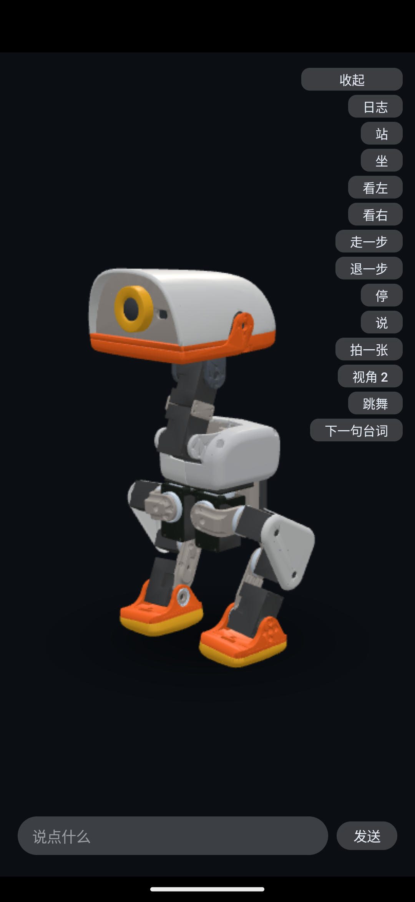

# manbo-duck — 屏幕上的鸭子

手机上的鸭子 agent。**屏幕上的那只 3D 鸭子就是它的身体**：它看得见（相机）、听得见（按住说一句）、
记得住（事件全在本机）。一句话之后，本机把"听到 / 看到 / 做过"拼成一段意图发给云端模型，
模型用 ReAct 决定做什么，鸭子就在屏幕上走过来、坐下、转头或者张嘴说话。

云端只收到文字、只下发意图（`stop` / `velocity` / `gaze` / `stand` / `sit`），**不写关节角、
不存记忆、不收媒体字节**。这是 [Fanduck](https://github.com/7757/fanduck) 的屏幕版复刻，
3D 模型来自 [pollen-robotics/microduck](https://github.com/pollen-robotics/microduck) 那台真机。



▶ [演示视频（webm，点开看）](doc/media/demo.webm)

## 它能干什么

- **说话**：按住屏幕说一句，或者用调试面板底部的打字框。**音频不会发给我们用的云端模型**
  （发过去的只有识别出来的文字）。至于识别本身在哪儿做，**取决于设备**：优先挑**端上识别**
  （音频不出手机），设备不支持中文就退到系统/厂商的识别服务 —— 那一路音频会到他们那边。
  当前用的是哪个，logcat 里 `识别源：…` 那条会写明（`duck-voice`）。
  鸭子说话期间和说完 800 ms 内的识别结果会被丢掉（静音窗口）—— 不堵的话它会听到自己。
  退到后台会自动切成**连续听**（前台服务持有麦克风，通知栏里能看到鸭子醒着），点通知回
  应用就停 —— 后台没有人能按住屏幕，只有这一种可能。
- **看得见**：每 2 秒取一帧（Camera2），本机 ML Kit 认一下（"看到 人、椅子"）+ 接近传感器测距离，
  写成一句「看到」；什么都没认出来就是 `摄像头正常，未识别物体`。图片只留在手机上，不上传
  —— 发出去的是标签，不是图。
- **记得住**：听到 / 打字 / 看到 / 做过的每一件事都落在 `episodes.jsonl`，按分词打分检索出最相关的
  几条拼进意图；轨迹太长会压缩成摘要。
- **长期记忆**：另外一份 `facts.jsonl`，几十条"用户叫 emin"这种长期成立的事。模型可以主动
  `remember`（"记住我喜欢喝美式"），攒够 40 条新经历也会自动把经历收成事实（**一次云调用**，
  只发经历的文字、不发媒体）。「记得」进每一次意图 —— 反复提到的事会刷新时间活着，
  久不提的自己变旧被淘汰。
- **会动**：15 个关节角 + 地面位置，30 fps 推到 WebView 里的 three.js。站、坐、走、转头、张嘴，
  外加一段《哈基米》的舞（122 BPM，八拍一循环）。
- **走的是真机训出来的步态**：`velstand.onnx`（Pollen 官方策略）在 MuJoCo + 真机电机模型里
  跑出来的一整个周期，烘成 `assets/duck/gaits.json`（20 帧 / 400 ms / 2.5 Hz）。
  不是手调的正弦 —— 连头跟着左右摆都是策略自己算的配平动作。见 `tools/duckgait/`。
- **能查**：一个日志页，把「这一轮发给云端的全部内容」「模型每一轮的原话」「拍到的帧」摊开看。

## 现在到哪一步

屏幕鸭子这一版**功能已经跑通**（下面这一列都是跑过的，不是设想）：

| | 状态 |
|---|---|
| 纯逻辑层（事件 / 记忆检索 / 长期记忆 / ReAct 主循环 / 轨迹压缩 / 姿态 / 识别源 / 检测结果 / 步态素材） | ✅ `./gradlew :core:test` 110 条断言，秒级 |
| 屏幕上的鸭子（真机 microduck 网格，9.7 万三角形） | ✅ 8 个观察机位、自动贴地、正面软跟随机位 |
| 语音输入 | ✅ 按住说话 + 静音窗口；退到后台切成连续听（前台服务持有麦克风） |
| 相机 + 距离 | ✅ 每 2 秒一拍 + 本机检测器（ML Kit，模型随 APK、不联网），盖住听筒会触发近距离拒绝 |
| 真云端 | ✅ DeepSeek（OpenAI 兼容）SSE 流式，8 秒无 token 报错、连接失败重试 1 次 |
| 调试面板 / 打字输入 / 日志页 / 跳舞 | ✅ 面板与输入条只在 debug 构建里挂 |

## 还差哪些

1. **接真机**：`RobotPort` 目前由 `ScreenRobot` 实现（屏幕 + TTS）。接口已经有返回通道
   （运动类方法回 `Ack`，真机拒绝的原因会落进 `did`），但**真机实现本身还没有** ——
   真机的控制环在另一个仓库里（`robotd` 的 50 Hz + ONNX 策略），得先把它拿过来。

## 跑起来

```bash
./gradlew :core:test          # 纯逻辑断言，不需要 SDK、模拟器或设备
./gradlew :app:assembleDebug  # → app/build/outputs/apk/debug/app-debug.apk
./gradlew :app:assembleRelease # → app/build/outputs/apk/release/（R8 开，19 MB）
```

云端配置放在 `local.properties`（这份文件不进版本库）：

```properties
duck.endpoint=https://api.deepseek.com/chat/completions
duck.model=deepseek-chat
duck.apiKey=sk-...        # 留空就退回演示用的假大脑，没网也能跑
duck.releaseApiKey=       # 只给 release 用。见下
```

**key 是明文编进包里的，所以分成两个**：`duck.apiKey` 只进 debug 包（自己天天用的那个），
`duck.releaseApiKey` 只进 release 包、默认空 —— 也就是说**默认编出来的 release 包不含任何 key**，
拿给谁都不会漏（代价是它只会用演示假大脑）。要签名就再填 `duck.storeFile` /
`duck.storePassword` / `duck.keyAlias` / `duck.keyPassword`，不填就出未签名的包。

```bash
adb install -r app/build/outputs/apk/debug/app-debug.apk
adb shell am start -n com.fanduck.agent/.MainActivity
```

### 桌面壳（Tauri）

同一只鸭子也能站在桌面上。`tauri-app/` 是个 Tauri 壳，`frontendDist` 直接指到
`app/src/main/assets/duck/` —— **一份 duck.js 两边用**，不是复制出来的第二份。

```bash
cd tauri-app
npm install
npm run dev          # 开窗口看鸭子；npm run build 出 .app/.dmg
```

这一版只有"能看见"那一层：渲染 + 窗口 resize。语音、相机、云端、agent 循环都还在 Android 那边，
桌面上"按住说话"这个交互也得重新想（没有触摸屏）。细节见 [`tauri-app/README.md`](tauri-app/README.md)。

四个容易踩的：

- 改 `app/src/main/assets/` 里的东西（`duck.js`、`duck-meshes.js`）**也必须重新 `assembleDebug`**：
  assets 是打进 APK 的，直接重装旧包就是跑旧代码。
- **APK 现在只有 arm64-v8a**（检测器带的 `libmlkitcommonpipeline.so` 四个 ABI 加起来 40 MB，
  见 `app/build.gradle` 的 `abiFilters`）。x86_64 的模拟器装不上 —— 要装就把它加回白名单。
- 模拟器：**API 28 的 AOSP 镜像 WebGL 上不了屏**（鸭子全黑，与本项目无关，最小 WebGL 探针页
  也一样黑）；API 34 的 google_apis 镜像正常。
- 语音识别在模拟器上连不上 Google（错误码 2），要有正文得用真机。

## 目录

```
core/            纯 Kotlin/JVM：事件、记忆检索、ReAct 主循环、姿态计算、静音窗口、舞步、步态素材
app/             Android 适配层：WebView 鸭子 / TTS / 语音 / Camera2 / DeepSeek HTTPS / Compose 日志页
tauri-app/       桌面壳：把 app/src/main/assets/duck/ 原样装进 Tauri 窗口（见它自己的 README）
tools/duckmesh/  离线网格管线（真机 STL → duck-meshes.js）
tools/duckgait/  离线步态管线（真机策略 → gaits.json，见它自己的 README）
tools/duckmesh/  离线网格管线：microduck 的 MJCF + STL → duck-meshes.js（见它自己的 README）
doc/             细节文档（见下）
```

细节都在 `doc/` 下：[架构](doc/architecture.md) · [屏幕上的鸭子](doc/duck-model.md) ·
[功能细节](doc/features.md) · [踩过的坑](doc/gotchas.md)

## 许可

* **代码**：Apache-2.0，见 [LICENSE](LICENSE)。
* **模型网格** `app/src/main/assets/duck/duck-meshes.js`：**CC BY-SA-NC** —— 从
  [pollen-robotics/microduck](https://github.com/pollen-robotics/microduck) 的模型文件生成，
  声明见同目录的 `duck-meshes.LICENSE.txt`。自己玩没问题；**对外分发 / 售卖 / 上架之前要先解决
  NC 这一条**。
* **音乐** `app/src/main/assets/dance/hakimi.mp3`：随仓库提供的演示素材。
